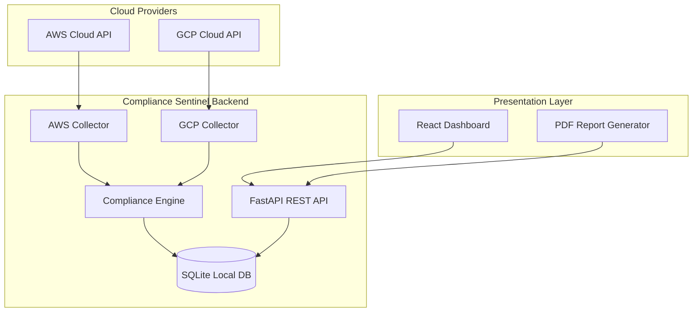

# System Architecture Design

CloudCompliance Sentinel is designed to be modular, read-only, and easily expandable.

## Key Subsystems

### 1. Collector Layer
Responsible for connecting to cloud provider environments, querying configurations of storage, database, and network resources, and normalising the payload.

### 2. Compliance Engine
Performs evaluation of the normalised resource representation against standard rules, identifying violations and severity markers.

### 3. Database Layer
Saves the latest resource configurations and the corresponding evaluations to a local SQLite database using SQLAlchemy ORM.

### 4. REST API Layer
Serves endpoints to trigger resource evaluation, fetch active compliance alerts, and get compliance progress summaries.
